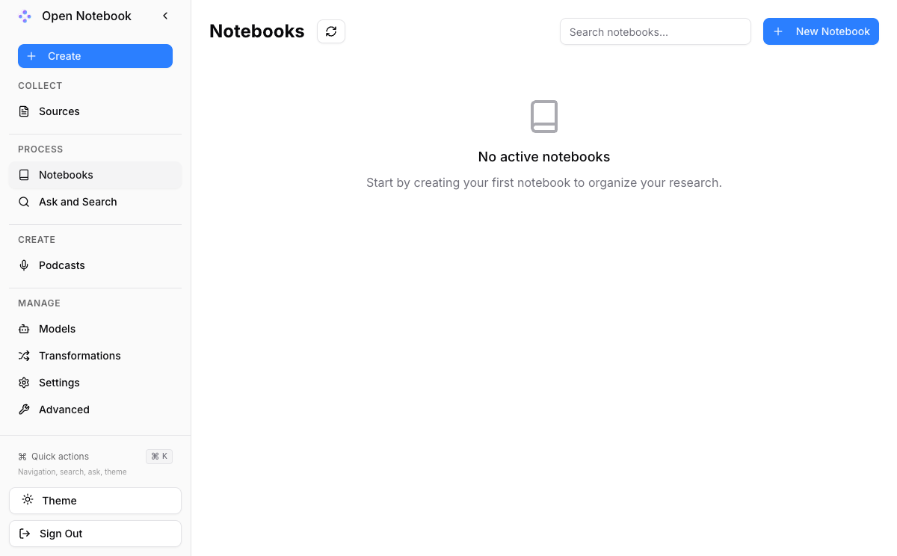

# Open Notebook 社区版计算巢服务实例使用文档

## 概述

Open Notebook 是一个私有、多模型、100%本地化、功能齐全的 Notebook LM 替代方案。该服务允许用户在本地环境中运行AI笔记本应用，支持多种AI模型集成，提供安全、私有的AI体验。

## 部署操作流程

1. 点击[部署链接](https://computenest.console.aliyun.com/service/simple/deploy?ServiceId=service-5b8972c0cb2f4ce89573)，进入服务实例部署界面，根据界面提示，填写参数。

    

2. 查看价格，在配置页面右侧可以查看按时长费用信息。

    

3. 点击"下一步：确认订单"按钮进入下一步

4. 点击创建实例,在确认订单页面，点击"立即购买"按钮创建实例。

5. 等待服务实例创建完成,部署过程通常需要1-2分钟，可以在服务详情页查看部署进度。

    

6. 服务部署成功后，在服务详情页找到公网访问地址，点击即可打开Open Notebook服务界面。

    

## 官方网站

更多信息请访问官方文档：[官网链接](https://www.open-notebook.ai/basics.html)